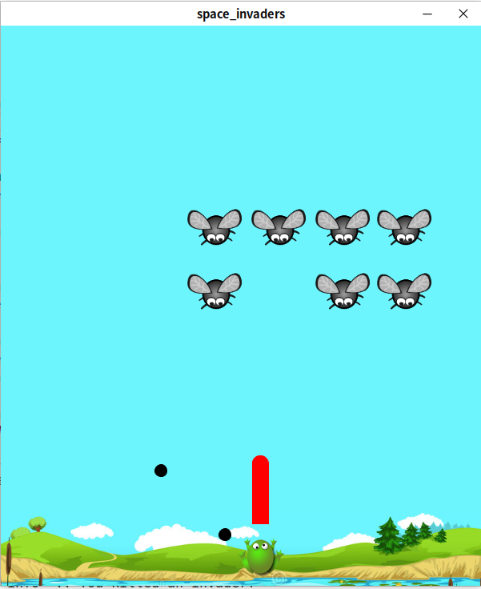

# Space-Invaders

- [Space-Invaders](#space-invaders)
  - [Preview](#preview)
    - [Theme frog](#theme-frog)
    - [Theme space](#theme-space)
    - [Create your own theme](#create-your-own-theme)
  - [Installation](#installation)

## Preview

For now the game is **available in 2 flavors**. 

### Theme frog

*In this first theme, you are a frog trying to eat flies.*

### Theme space

*This second theme is closer to the original space invader design...*

### Create your own theme

You can easily create your own by copying one of the theme folder and editing the sprites and settings inside.

## Installation

1. [Download](https://github.com/ENSSAT/space-invader/releases/) the latest version of the game for your platform.
2. Extract content of the zip where you want to install it.
3. To play, launch `space_invaders(.exe)`
